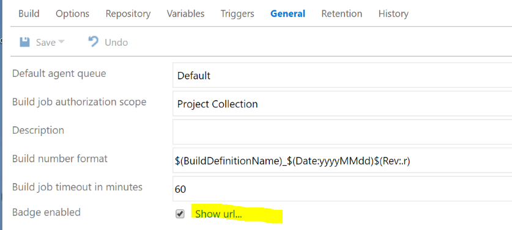
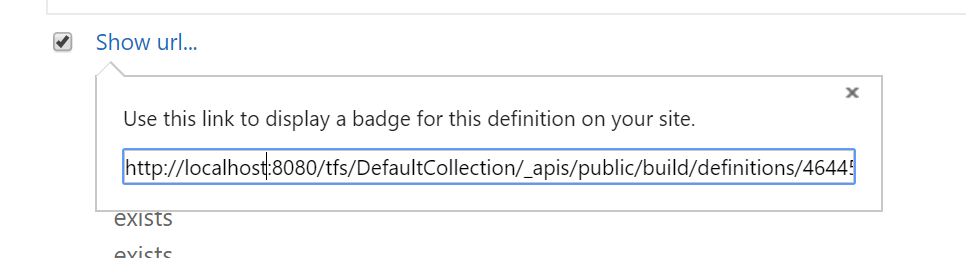
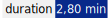
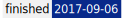
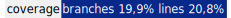
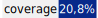
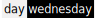

# Creating Badges

## Getting necessary information from TFS or VSTS

For the build definition that you want to generate custom badges with TfsInfoService for,
got to its build definition. Under "General" make sure that "Badge enabled" is selected,
then click on the "Show url..." link.

The following appears:

An example link from the build badge looks like this:

    http://localhost:8080/tfs/DefaultCollection/_apis/public/build/definitions/46445cbf-77d6-4626-9f91-f0ac6eb19dbe/233/badge

The guid in the link is the project guid (here: 46445cbf-77d6-4626-9f91-f0ac6eb19dbe), the integer after it is the build ID
(here: 233). You'll need these two for your URLs with TfsInfoService.

## Creating Badges

The basic structure of an URL is:

    http://<host:port>/_apis/infos/<project guid>/<build id>/<type>/badge[?<parameters>]

* `<host:port>`: the listen address of TfsInfoService (e.g. localhost:5000)
* `<project guid>`: the project guid (see above)
* `<build id>`: the numeric build id (see above)
* `<type>`: the type of information to gather a badge for
* `<parameters>`: optional parameters to tailer the badge generated

Currently, the following types are available:
"buildnumber", "duration", "finishdate", "coverage", "best-coverage", "custom"

* `buildnumber`: The build number (e.g. "MyBuild_20170913.1")
* `duration`: The duration of the build in minutes
* `finishdate`: The date when the build finished
* `coverage`: Code coverage stats for the build, if any.
* `best-coverage`: Code coverage stats for the build; if multiple are available (e.g. "Lines", "Branches"),
the one with the best value is chosen.
* `custom`: Don't contact TFS/VSTS instance, but rather generate a fully custom badge out of the `<parameters>` passed.

Optional URL parameters are:

* `title`: set a custom title for the badge (the "left" text of the badge)
* `titlefg`: specify a custom foreground color (e.g. `#fff`) for the title.
* `titlebg`: specify a custom background color (e.g. `#fff`) for the title.
* `valuefg`: specify a custom foreground color (e.g. `#fff`) for the value.
* `valuebg`: specify a custom background color (e.g. `#fff`) for the value.
* `value`: specify a custom value (only used with type `custom`).

Example Badges:

|Type|Sample|
|:---|-----:|
|buildnumber||
|duration||
|finishdate||
|coverage||
|best-coverage||
|custom||

